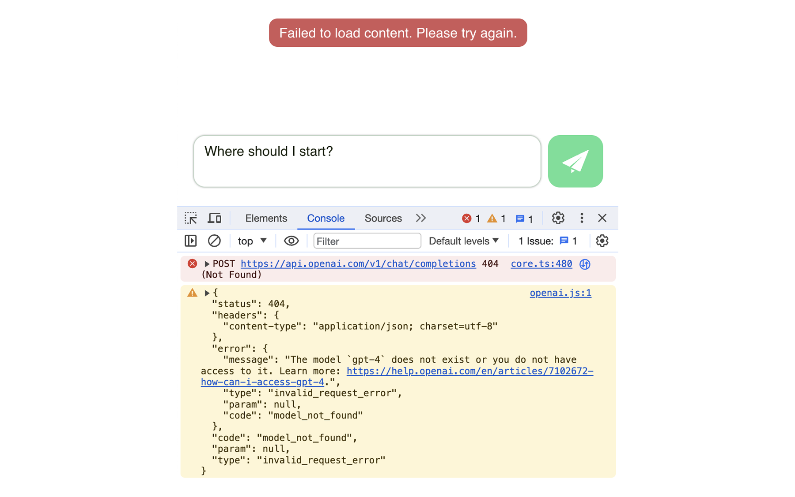

# Error Handling

When using the OpenAI Adapter, you may encounter errors.  
This page will help you understand what they mean and how to
fix them.

## Logging And Display Of Errors

When the user sees an error, a brief description of the error will be displayed. The full error will be logged to the
console. This is useful for debugging.

Example:



In the logs, you will see the full error message, including the error code and the error message. Example:

```text
{
  "status": 404,
  "type": "invalid_request_error"
  "error": {
    "message": "The model `gpt-4` does not exist or you do not have access to it. Learn more: https://help.openai.com/en/articles/7102672-how-can-i-access-gpt-4.",
    "type": "invalid_request_error",
    "param": null,
    "code": "model_not_found"
  },
}
```

Those logs show the errors returned by the OpenAI API.

In this example, the error code is `model_not_found`. This is shown because **a free tier API key was used, and
the model `gpt-4` is not available in the free tier**. The user needs to upgrade to the paid tier to use this model.

You can find more information about all of OpenAI's error codes in the
[OpenAI API documentation](https://platform.openai.com/docs/guides/error-codes/api-errors).

## Common Issues When Making Your First API Call

You may encounter some of the following issues when using your API key.

* **Invalid API key:** Make sure you have copied the API key correctly. It should be a long string of characters.
* **Too Many Requests:** If you are using the free tier, you may have exceeded the number of requests allowed.
* **Model Not Found:** If you are using the free tier, it's possible that you are trying to use a model that is not
  available in the free tier. Try using a different model or upgrading to the paid tier.

You can find here a complete list
of [OpenAI's API error codes](https://platform.openai.com/docs/guides/error-codes/api-errors).

## Help And Support

* If you need help, you can drop a message on the [GitHub Discussions](https://github.com/nluxai/nlux/discussions)
  page. Salmen or other members of the community will be happy to help you.
* OpenAI also has a [developer forum](https://community.openai.com/) where you can ask questions about OpenAI's APIs.
